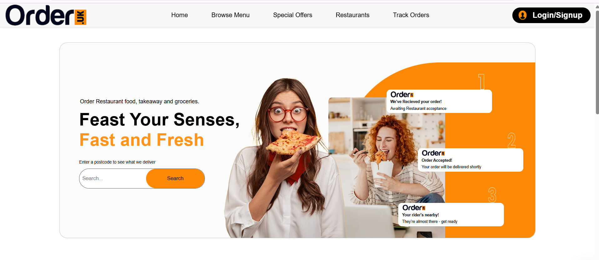
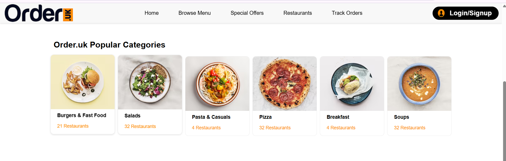
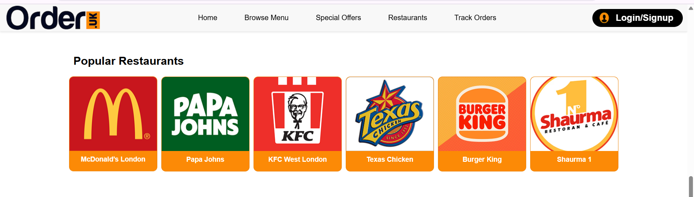

# WebFood_Interface

Dự án **WebFood_Interface** là một giao diện web được xây dựng bằng HTML, CSS và JavaScript, mang đến trải nghiệm người dùng mượt mà và trực quan cho một nền tảng đặt món ăn trực tuyến. Thiết kế giao diện được tạo và quản lý trên Figma, bạn có thể xem prototype chi tiết tại: [Thiết kế Figma WebFood](https://www.figma.com/design/FVXpQZx0JqN5959V8svIQs/Food-Delivery-Website---App-Design-UI-Kit--Community-?node-id=0-1&p=f&t=Nsnhn7qIprhfPu0r-0).

## Giao diện Trang chủ

Trang chủ của WebFood được chia thành các phần chính, được thể hiện qua các ảnh chụp màn hình dưới đây:

*Phần Quảng cáo trên trang chủ, hiển thị các chương trình khuyến mãi hấp dẫn với hình ảnh nổi bật và nút kêu gọi hành động.*

*Phần Categories, liệt kê các danh mục món ăn phổ biến, giúp người dùng dễ dàng tìm kiếm theo sở thích.*

*Phần Restaurants, giới thiệu các nhà hàng đối tác với thông tin cơ bản và hình ảnh minh họa, hỗ trợ người dùng lựa chọn địa điểm.*
